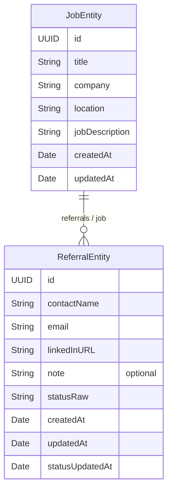
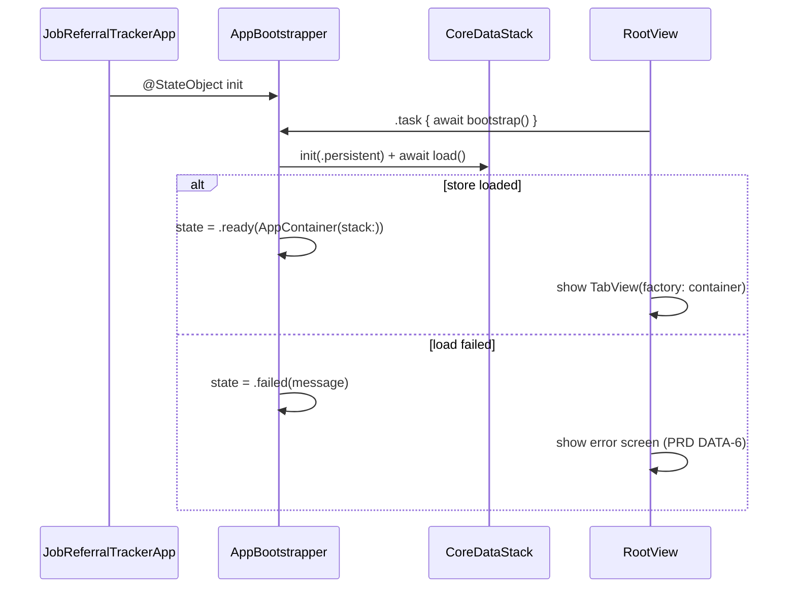

# Job Referral Tracker — Technical Architecture

| | |
|---|---|
| **Min iOS** | 16.0 |
| **Language** | Swift 5 language mode, strict concurrency checking: `targeted` |
| **UI** | SwiftUI, `NavigationStack`, Swift Charts |
| **Persistence** | Core Data (SQLite store, on-device) |
| **Networking** | None |
| **Third-party dependencies** | None |
| **Status** | Draft v1.0 — 2026-09-25 |

Related: [Product Requirements](PRD.md)

---

## 1. Architectural Principles

1. **Clean Architecture.** The code is split into three layers — **Domain**, **Data**, **Presentation** — plus an **App** composition root. Dependencies point inward only: Presentation → Domain ← Data.
2. **The Domain is pure Swift.** It imports only `Foundation`. It never imports `CoreData`, `SwiftUI` or `UIKit`.
3. **No `NSManagedObject` leaves the Data layer.** Repositories map managed objects to immutable domain `struct`s inside the Core Data context's queue.
4. **Dependency injection, no service singletons.** Every repository, use case and ViewModel receives its dependencies through its initializer. Everything is wired once in `AppContainer`.
5. **Modern concurrency.** Commands are `async throws`. Live data is delivered as `AsyncThrowingStream`. ViewModels are `@MainActor ObservableObject`s that publish UI state with `@Published`.
6. **Testable by design.** Time and ID generation are injected. Repositories are protocols. Core Data can run in memory.

## 2. Layer Overview

```mermaid
flowchart LR
    subgraph Presentation["Presentation (SwiftUI)"]
        V[Views] --> VM[ViewModels<br/>@MainActor ObservableObject]
    end
    subgraph Domain["Domain (pure Swift)"]
        UC[Use Cases] --> RP[[Repository protocols]]
        UC --> E[Entities / Value types<br/>Validators / Calculators]
    end
    subgraph Data["Data (Core Data)"]
        RI[Core Data repositories] --> MO[NSManagedObject subclasses]
        RI --> MAP[Mappers]
        RI --> CS[CoreDataStack]
        CO[CoreDataChangeObserver] --> CS
    end
    subgraph App["App (composition root)"]
        AC[AppContainer]
    end
    VM --> UC
    RI -. implements .-> RP
    CO -. implements .-> RP
    AC --> VM
    AC --> UC
    AC --> RI
```

| Layer | Responsibility | May import | Must not import |
|---|---|---|---|
| **Domain** | Entities, business rules, validation, use cases, repository protocols, analytics calculation. | `Foundation` | `CoreData`, `SwiftUI`, `UIKit`, `Charts` |
| **Data** | Core Data stack, managed objects, mapping, repository implementations, change notifications. | `Foundation`, `CoreData`, Domain | `SwiftUI`, `UIKit` |
| **Presentation** | Views, ViewModels, navigation, UI formatting (status colors, titles, dates). | `Foundation`, `SwiftUI`, `Charts`, Domain | `CoreData`, Data |
| **App** | App entry point, store bootstrapping, dependency wiring, factories. | Everything | — |

All layers live in the single `JobReferralTracker` app target and are separated by folders. The import rules above are enforced by code review (and optionally a SwiftLint `custom_rules` check). The layers can later be extracted into local Swift packages without code changes.

## 3. Project Structure

```
JobReferralTracker/
├── App/
│   ├── JobReferralTrackerApp.swift        # @main, owns AppBootstrapper
│   ├── AppBootstrapper.swift              # loads the store asynchronously → AppContainer or error
│   ├── AppContainer.swift                 # composition root: builds repositories, use cases
│   ├── AppContainer+ViewModelFactory.swift
│   └── RootView.swift                     # loading / failed / TabView
│
├── Domain/
│   ├── Entities/
│   │   ├── Job.swift
│   │   ├── JobSummary.swift
│   │   ├── Referral.swift
│   │   ├── ReferralStatus.swift
│   │   ├── ReferralListItem.swift
│   │   └── ReferralAnalytics.swift        # StatusBreakdown, JobReferralBreakdown, ReferralAnalytics
│   ├── Inputs/
│   │   ├── JobDraft.swift
│   │   └── ReferralDraft.swift
│   ├── Validation/
│   │   ├── ValidationResult.swift         # ValidationIssue, ValidationResult<Field>
│   │   ├── TextRules.swift                # shared required/length rules, String.trimmed
│   │   ├── JobValidator.swift
│   │   └── ReferralValidator.swift
│   ├── Errors/
│   │   └── DomainError.swift
│   ├── Repositories/                      # protocols only
│   │   ├── JobRepository.swift
│   │   ├── ReferralRepository.swift
│   │   └── DataChangeObserving.swift
│   ├── Services/
│   │   ├── ReferralAnalyticsCalculator.swift
│   │   ├── ReferralFilter.swift
│   │   └── LiveQuery.swift                # fetch + re-fetch on change → AsyncThrowingStream
│   └── UseCases/
│       ├── Jobs/                          # Observe/Create/Update/Delete
│       ├── Dependencies.swift             # DateProvider, IDGenerator
│       ├── Referrals/                     # Observe/Add/Update/UpdateStatus/Delete + shared validatedFields
│       └── Analytics/                     # ObserveReferralAnalytics, ObserveAllReferrals
│
├── Data/
│   ├── CoreData/
│   │   ├── CoreDataStack.swift
│   │   ├── CoreDataChangeObserver.swift
│   │   ├── JobReferralTracker.xcdatamodeld
│   │   └── ManagedObjects/
│   │       ├── JobEntity.swift
│   │       └── ReferralEntity.swift
│   ├── Mappers/
│   │   ├── JobEntity+Mapping.swift
│   │   └── ReferralEntity+Mapping.swift
│   ├── Repositories/
│   │   ├── CoreDataJobRepository.swift
│   │   └── CoreDataReferralRepository.swift
│   └── DataError.swift
│
├── Presentation/
│   ├── Navigation/
│   │   ├── AppRoute.swift
│   │   ├── Router.swift
│   │   └── ViewModelFactory.swift         # protocol
│   ├── Common/
│   │   ├── LoadState.swift
│   │   ├── ReferralStatus+UI.swift        # title, color, SF Symbol
│   │   ├── StatusBadge.swift
│   │   ├── StatusBreakdownBar.swift
│   │   ├── EmptyStateView.swift
│   │   └── ValidationIssue+Message.swift
│   └── Features/
│       ├── JobList/        JobListView, JobSummaryCard, JobListViewModel
│       ├── JobForm/        JobFormView, JobFormViewModel
│       ├── JobDetail/      JobDetailView, JobDetailViewModel
│       ├── ReferralForm/   ReferralFormView, ReferralFormViewModel
│       ├── ReferralDetail/ ReferralDetailView, ReferralDetailViewModel
│       └── Analytics/      AnalyticsView, JobBreakdownRow, AllReferralsList, AnalyticsViewModel
│
├── Resources/
│   └── Assets.xcassets
└── Preview Content/
    ├── Preview Assets.xcassets
    └── PreviewData.swift                  # sample jobs/referrals, AppContainer.preview()

JobReferralTrackerTests/
├── Domain/        JobValidatorTests, ReferralValidatorTests, JobUseCaseTests
├── Data/          CoreDataJobRepositoryTests, CoreDataReferralRepositoryTests
├── Presentation/  JobFormViewModelTests, ReferralFormViewModelTests, AnalyticsViewModelTests
└── TestDoubles/   InMemoryRepository, Fixtures (dates, UUIDs, SequentialIDs)
```

## 4. Domain Layer

### 4.1 Entities

All domain types are value types, `Sendable` and `Equatable`. IDs are `UUID`s generated by the app.

```swift
struct Job: Identifiable, Hashable, Sendable {
    let id: UUID
    var title: String
    var company: String
    var location: String          // "" when not provided
    var jobDescription: String    // "" when not provided (`description` clashes with NSObject)
    let createdAt: Date
    var updatedAt: Date
}

/// Home-screen card data.
struct JobSummary: Identifiable, Hashable, Sendable {
    let job: Job
    let referralCount: Int
    var id: UUID { job.id }
}

enum ReferralStatus: String, CaseIterable, Identifiable, Hashable, Sendable {
    case pending, contacted, interview, hired, rejected   // declaration order = pipeline order

    var id: String { rawValue }
    var isClosed: Bool { self == .hired || self == .rejected }
}

struct Referral: Identifiable, Hashable, Sendable {
    let id: UUID
    let jobID: UUID
    var contactName: String
    var email: String             // normalized: trimmed, lower-cased
    var linkedInURL: URL          // normalized: always https
    var note: String?             // nil when blank
    var status: ReferralStatus
    let createdAt: Date
    var updatedAt: Date
    var statusUpdatedAt: Date
}

/// Row in the unified "All Referrals" list: a referral plus its job's display info.
struct ReferralListItem: Identifiable, Hashable, Sendable {
    let referral: Referral
    let jobTitle: String
    let company: String
    var id: UUID { referral.id }
}
```

#### Analytics value types

```swift
struct StatusBreakdown: Hashable, Sendable {
    let counts: [ReferralStatus: Int]      // every status present, 0 when none

    init<S: Sequence>(statuses: S) where S.Element == ReferralStatus

    var total: Int { counts.values.reduce(0, +) }
    func count(for status: ReferralStatus) -> Int { counts[status, default: 0] }

    static let empty = StatusBreakdown(statuses: [])
}

struct JobReferralBreakdown: Identifiable, Hashable, Sendable {
    let job: Job
    let breakdown: StatusBreakdown
    var id: UUID { job.id }
}

struct ReferralAnalytics: Hashable, Sendable {
    let overall: StatusBreakdown
    let perJob: [JobReferralBreakdown]     // jobs with referrals first (by total desc), then empty jobs
}
```

### 4.2 Inputs (Drafts)

Forms edit a mutable *draft*. Use cases validate and normalize the draft before creating or updating an entity.

```swift
struct JobDraft: Hashable, Sendable {
    var title = ""
    var company = ""
    var location = ""
    var jobDescription = ""

    init() {}
    init(job: Job) { /* copies fields for edit mode */ }
}

struct ReferralDraft: Hashable, Sendable {
    var contactName = ""
    var email = ""
    var linkedInProfile = ""      // raw text as typed; normalized to URL on save
    var note = ""
    var status: ReferralStatus = .pending

    init() {}
    init(referral: Referral) { /* copies fields for edit mode */ }
}
```

### 4.3 Validation

Validators are pure structs with no dependencies. ViewModels use them to show inline errors as the user types. Use cases run them again before saving, so invalid data can never reach the store.

```swift
enum ValidationIssue: Hashable, Sendable {
    case required
    case tooLong(max: Int)
    case invalidEmail
    case invalidLinkedInURL
    case duplicateEmail
}

struct ValidationResult<Field: Hashable & Sendable>: Hashable, Sendable {
    var issues: [Field: ValidationIssue] = [:]
    var isValid: Bool { issues.isEmpty }
    subscript(field: Field) -> ValidationIssue? { issues[field] }
}

enum JobField: Hashable, Sendable { case title, company, location, jobDescription }
enum ReferralField: Hashable, Sendable { case contactName, email, linkedInProfile, note }

struct JobValidator: Sendable {
    func validate(_ draft: JobDraft) -> ValidationResult<JobField>
    func normalized(_ draft: JobDraft) -> JobDraft          // trims whitespace
}

struct ReferralValidator: Sendable {
    func validate(_ draft: ReferralDraft) -> ValidationResult<ReferralField>
    func normalizedEmail(_ raw: String) -> String            // trim + lowercase
    func normalizedLinkedInURL(_ raw: String) -> URL?        // nil when invalid
}
```

#### Validation rules

| Entity | Field | Rule | Issue |
|---|---|---|---|
| Job | title | Trimmed, not empty | `.required` |
| Job | title | ≤ 120 characters | `.tooLong(max: 120)` |
| Job | company | Trimmed, not empty | `.required` |
| Job | company | ≤ 120 characters | `.tooLong(max: 120)` |
| Job | location | ≤ 120 characters (optional) | `.tooLong(max: 120)` |
| Job | jobDescription | ≤ 5,000 characters (optional) | `.tooLong(max: 5000)` |
| Referral | contactName | Trimmed, not empty; ≤ 120 | `.required` / `.tooLong` |
| Referral | email | Trimmed, not empty | `.required` |
| Referral | email | Matches `^[A-Z0-9._%+-]+@[A-Z0-9.-]+\.[A-Z]{2,}$` (case-insensitive) | `.invalidEmail` |
| Referral | email | Unique per job (checked by the use case against the repository) | `.duplicateEmail` |
| Referral | linkedInProfile | Trimmed, not empty | `.required` |
| Referral | linkedInProfile | If no scheme, prefix `https://`. Scheme is `http`/`https`; host is `linkedin.com` or ends with `.linkedin.com`; path is not empty or `/`. Saved as `https`. | `.invalidLinkedInURL` |
| Referral | note | ≤ 2,000 characters (optional); blank → `nil` | `.tooLong(max: 2000)` |

### 4.4 Errors

```swift
enum DomainError: Error, Equatable {
    case invalidJob(ValidationResult<JobField>)
    case invalidReferral(ValidationResult<ReferralField>)
    case jobNotFound(id: UUID)
    case referralNotFound(id: UUID)
    case persistenceFailure(message: String)   // Data-layer errors are wrapped into this
}
```

The Data layer throws `DataError` internally (`storeLoadFailed`, `saveFailed`, `corruptRecord(entity:id:)`). Repositories convert it to `DomainError.persistenceFailure` at the boundary, so the Presentation layer only ever handles `DomainError`.

### 4.5 Repository Protocols

```swift
protocol JobRepository: Sendable {
    func fetchJobs() async throws -> [Job]                      // newest first
    func fetchJobSummaries() async throws -> [JobSummary]       // newest first, with referral counts
    func fetchJob(id: UUID) async throws -> Job?
    func create(_ job: Job) async throws
    func update(_ job: Job) async throws                        // throws jobNotFound
    func deleteJob(id: UUID) async throws                       // cascades to referrals
}

protocol ReferralRepository: Sendable {
    func fetchReferrals(jobID: UUID) async throws -> [Referral] // updatedAt desc
    func fetchAllReferrals() async throws -> [Referral]
    func fetchAllReferralItems() async throws -> [ReferralListItem] // updatedAt desc, with job info
    func fetchReferral(id: UUID) async throws -> Referral?
    func fetchReferralItem(id: UUID) async throws -> ReferralListItem? // referral + job title/company
    func emailExists(_ email: String, jobID: UUID, excludingReferralID: UUID?) async throws -> Bool
    func create(_ referral: Referral) async throws              // throws jobNotFound
    func update(_ referral: Referral) async throws              // throws referralNotFound
    func deleteReferral(id: UUID) async throws
}

/// Emits an event every time the persistent store saves changes.
protocol DataChangeObserving: Sendable {
    func changes() -> AsyncStream<Void>
}
```

### 4.6 Live Queries

Screens must refresh when data changes anywhere in the app (PRD HOME-7, TRACK-4). One generic helper turns any fetch into a live stream:

```swift
struct LiveQuery: Sendable {
    let changeObserver: DataChangeObserving

    func stream<Value: Sendable>(
        _ fetch: @escaping @Sendable () async throws -> Value
    ) -> AsyncThrowingStream<Value, Error> {
        AsyncThrowingStream { continuation in
            // Subscribe BEFORE the first fetch so a change between the two is not missed.
            let changes = changeObserver.changes()
            let task = Task {
                do {
                    continuation.yield(try await fetch())
                    for await _ in changes {
                        continuation.yield(try await fetch())
                    }
                    continuation.finish()
                } catch {
                    continuation.finish(throwing: error)
                }
            }
            continuation.onTermination = { _ in task.cancel() }
        }
    }
}
```

Re-fetching everything on each save is simple and fast enough for the PRD's target size (≤ 5,000 referrals). If needed later, it can be replaced by `NSFetchedResultsController`-backed streams in the Data layer without changing the Domain API.

### 4.7 Use Cases

Each use case is a small `struct` with one `execute` method. Dependencies (repositories, validators, clock, ID generator) are injected through the initializer.

```swift
typealias DateProvider = @Sendable () -> Date   // injected; `{ Date() }` in the app (`Clock` is taken by the standard library)
typealias IDGenerator = @Sendable () -> UUID    // injected; `{ UUID() }` in the app
```

| Use case | Signature | Behavior |
|---|---|---|
| `ObserveJobSummariesUseCase` | `execute() -> AsyncThrowingStream<[JobSummary], Error>` | Live list for Home. |
| `ObserveJobUseCase` | `execute(id:) -> AsyncThrowingStream<Job?, Error>` | Live job for Job Detail; `nil` once deleted. |
| `CreateJobUseCase` | `execute(_ draft: JobDraft) async throws -> Job` | Validate → normalize → new `id`, `createdAt = updatedAt = now` → `create`. |
| `UpdateJobUseCase` | `execute(id:, draft:) async throws -> Job` | Validate → fetch (or `jobNotFound`) → apply draft, `updatedAt = now` → `update`. |
| `DeleteJobUseCase` | `execute(id:) async throws` | Deletes job and its referrals. |
| `ObserveReferralsUseCase` | `execute(jobID:) -> AsyncThrowingStream<[Referral], Error>` | Live referrals for Job Detail. |
| `ObserveReferralUseCase` | `execute(id:) -> AsyncThrowingStream<ReferralListItem?, Error>` | Live referral (with job title/company) for Referral Detail. |
| `AddReferralUseCase` | `execute(jobID:, draft:) async throws -> Referral` | Validate → email unique in job → normalize → new `id`; `createdAt = updatedAt = statusUpdatedAt = now` → `create` (the repository throws `jobNotFound` if the job is gone). |
| `UpdateReferralUseCase` | `execute(id:, draft:) async throws -> Referral` | Validate → fetch → email unique (excluding self) → apply; `updatedAt = now`; `statusUpdatedAt = now` only if status changed → `update`. |
| `UpdateReferralStatusUseCase` | `execute(id:, status:) async throws -> Referral` | Fetch → no-op if unchanged → set status, `updatedAt = statusUpdatedAt = now` → `update`. |
| `DeleteReferralUseCase` | `execute(id:) async throws` | Deletes a referral. |
| `ObserveReferralAnalyticsUseCase` | `execute() -> AsyncThrowingStream<ReferralAnalytics, Error>` | Fetches jobs + referrals, runs `ReferralAnalyticsCalculator`. |
| `ObserveAllReferralsUseCase` | `execute() -> AsyncThrowingStream<[ReferralListItem], Error>` | Live unified list; filtering happens in the ViewModel with `ReferralFilter`. |

`AddReferralUseCase` and `UpdateReferralUseCase` share `ReferralValidator.validatedFields(for:jobID:excludingReferralID:repository:)`. It runs the field rules, adds `.duplicateEmail` when the email is already used in the same job, and returns `NormalizedReferralFields`, or throws `DomainError.invalidReferral` with every issue found.

Example — job creation (the logic covered by PRD TEST-1):

```swift
struct CreateJobUseCase: Sendable {
    let repository: JobRepository
    let validator: JobValidator
    let now: DateProvider
    let makeID: IDGenerator

    func execute(_ draft: JobDraft) async throws -> Job {
        let result = validator.validate(draft)
        guard result.isValid else { throw DomainError.invalidJob(result) }

        let clean = validator.normalized(draft)
        let timestamp = now()
        let job = Job(id: makeID(), title: clean.title, company: clean.company,
                      location: clean.location, jobDescription: clean.jobDescription,
                      createdAt: timestamp, updatedAt: timestamp)
        try await repository.create(job)
        return job
    }
}
```

### 4.8 Domain Services

```swift
struct ReferralAnalyticsCalculator: Sendable {
    func makeAnalytics(jobs: [Job], referrals: [Referral]) -> ReferralAnalytics
}

enum ReferralFilter: Hashable, Sendable {
    case all
    case status(ReferralStatus)

    static let allCases: [ReferralFilter]                 // .all, then each status in pipeline order
    func apply(to items: [ReferralListItem]) -> [ReferralListItem]
    static func counts(in items: [ReferralListItem]) -> [ReferralFilter: Int]
}
```

`makeAnalytics` groups referrals by `jobID`, builds a `StatusBreakdown` with every status (zeros included) for each job, sums them into `overall`, and orders `perJob` by total descending, then title ascending. Jobs with no referrals come last. Referrals whose `jobID` has no matching job are ignored.

### 4.9 Business Rules Summary

| ID | Rule |
|---|---|
| BR-1 | A referral always belongs to exactly one existing job. |
| BR-2 | Deleting a job deletes all its referrals. |
| BR-3 | A new referral starts as `pending` unless the form sets another status. |
| BR-4 | Any status can move to any other status. |
| BR-5 | `statusUpdatedAt` changes only when the status actually changes. |
| BR-6 | `updatedAt` changes on every successful edit, including status changes. |
| BR-7 | Emails are unique per job (case-insensitive), not across jobs. |
| BR-8 | Stored strings are trimmed; emails are lower-cased; LinkedIn URLs are stored as `https`. |

## 5. Data Layer

### 5.1 Core Data Model

Model file: `JobReferralTracker.xcdatamodeld`, version 1 `JobReferralTracker`. **Codegen: Manual/None** — managed object subclasses are written by hand in `Data/CoreData/ManagedObjects/`, so no generated type can leak into other layers.



#### `JobEntity`

| Attribute | Core Data type | Optional | Default | Notes |
|---|---|---|---|---|
| `id` | UUID | No | — | App-generated primary identifier. |
| `title` | String | No | `""` | |
| `company` | String | No | `""` | |
| `location` | String | No | `""` | |
| `jobDescription` | String | No | `""` | Not named `description` (clashes with `NSObject.description`). |
| `createdAt` | Date | No | — | Indexed (Home sort). |
| `updatedAt` | Date | No | — | |

| Relationship | Destination | Type | Optional | Delete rule | Inverse |
|---|---|---|---|---|---|
| `referrals` | `ReferralEntity` | To-many (unordered) | Yes | **Cascade** | `job` |

#### `ReferralEntity`

| Attribute | Core Data type | Optional | Default | Notes |
|---|---|---|---|---|
| `id` | UUID | No | — | App-generated primary identifier. |
| `contactName` | String | No | `""` | |
| `email` | String | No | `""` | Stored normalized (lower-case). |
| `linkedInURL` | String | No | `""` | Absolute `https` URL string. |
| `note` | String | Yes | — | `nil` when blank. |
| `statusRaw` | String | No | `"pending"` | `ReferralStatus.rawValue`. Indexed (filtering). |
| `createdAt` | Date | No | — | |
| `updatedAt` | Date | No | — | Indexed (list sort). |
| `statusUpdatedAt` | Date | No | — | |

| Relationship | Destination | Type | Optional | Delete rule | Inverse |
|---|---|---|---|---|---|
| `job` | `JobEntity` | To-one | No | **Nullify** | `referrals` |

**Fetch indexes:** `JobEntity.byCreatedAt (createdAt)`, `ReferralEntity.byUpdatedAt (updatedAt)`, `ReferralEntity.byStatus (statusRaw)`.

**Uniqueness:** there are no Core Data uniqueness constraints. IDs are UUIDs generated by the app, and the per-job email rule is enforced in the Domain (BR-7). This keeps the model compatible with a future `NSPersistentCloudKitContainer` migration.

**Migration:** lightweight migration is enabled (`shouldMigrateStoreAutomatically` and `shouldInferMappingModelAutomatically` are both `true`). Every schema change adds a new model version.

### 5.2 Managed Object Subclasses

```swift
@objc(JobEntity)
final class JobEntity: NSManagedObject {
    @NSManaged var id: UUID
    @NSManaged var title: String
    @NSManaged var company: String
    @NSManaged var location: String
    @NSManaged var jobDescription: String
    @NSManaged var createdAt: Date
    @NSManaged var updatedAt: Date
    @NSManaged var referrals: Set<ReferralEntity>
}

@objc(ReferralEntity)
final class ReferralEntity: NSManagedObject {
    @NSManaged var id: UUID
    @NSManaged var contactName: String
    @NSManaged var email: String
    @NSManaged var linkedInURL: String
    @NSManaged var note: String?
    @NSManaged var statusRaw: String
    @NSManaged var createdAt: Date
    @NSManaged var updatedAt: Date
    @NSManaged var statusUpdatedAt: Date
    @NSManaged var job: JobEntity
}
```

Each subclass also has a typed `fetchRequest()` helper and a predicate helper such as `static func predicate(id: UUID) -> NSPredicate`.

### 5.3 Mapping

| Direction | Function | Notes |
|---|---|---|
| Entity → Domain | `JobEntity.toDomain() -> Job` | Direct field copy. |
| Entity → Domain | `JobEntity.toSummary() -> JobSummary` | `referralCount = referrals.count`. |
| Entity → Domain | `ReferralEntity.toDomain() throws -> Referral` | `jobID = job.id`. Throws `DataError.corruptRecord` if `statusRaw` or `linkedInURL` cannot be parsed. |
| Entity → Domain | `ReferralEntity.toListItem() throws -> ReferralListItem` | Adds `job.title` and `job.company`. |
| Domain → Entity | `JobEntity.apply(_ job: Job)` | Copies all fields. |
| Domain → Entity | `ReferralEntity.apply(_ referral: Referral, job: JobEntity)` | `linkedInURL.absoluteString`, `status.rawValue`. |

Mapping always runs **inside** `context.perform { }`, so managed objects are never touched off their queue.

### 5.4 Core Data Stack

```swift
final class CoreDataStack: @unchecked Sendable {
    enum StoreType { case persistent, inMemory }

    /// Loaded once per process: loading the same .momd more than once confuses Core Data
    /// ("multiple NSEntityDescriptions claim NSManagedObject subclass"), especially in tests.
    /// This is an immutable model description, not a service singleton.
    static let model: NSManagedObjectModel = { /* load "JobReferralTracker.momd" from the bundle */ }()

    let container: NSPersistentContainer
    var viewContext: NSManagedObjectContext { container.viewContext }

    init(storeType: StoreType = .persistent)        // in memory → store URL "/dev/null"
    func load() async throws                        // wraps loadPersistentStores; throws DataError.storeLoadFailed
    func performBackgroundTask<T>(_ block: @escaping (NSManagedObjectContext) throws -> T) async throws -> T
}
```

Configuration:
- `viewContext.automaticallyMergesChangesFromParent = true`
- All contexts use `mergePolicy = NSMergeByPropertyObjectTrumpMergePolicy`
- `performBackgroundTask` creates a new background context (`container.newBackgroundContext()`), runs the block with `await context.perform { }` (iOS 15+ API), and saves only if `context.hasChanges`.
- **All repository reads and writes run on background contexts.** The UI only ever receives domain value types, so the view context is not used for UI binding.

### 5.5 Change Observer

```swift
final class CoreDataChangeObserver: DataChangeObserving {
    init(stack: CoreDataStack, notificationCenter: NotificationCenter = .default)
    func changes() -> AsyncStream<Void>
}
```

It listens for `.NSManagedObjectContextDidSave` and keeps only notifications whose context's `persistentStoreCoordinator` is this stack's coordinator. That way, parallel in-memory stacks in tests do not affect each other. It yields one `Void` per save, using the `.bufferingNewest(1)` buffering policy so a burst of saves causes only one re-fetch.

### 5.6 Repository Implementations

`CoreDataJobRepository` and `CoreDataReferralRepository` receive a `CoreDataStack` through `init` and implement the Domain protocols.

| Operation | Implementation notes |
|---|---|
| Fetch jobs / summaries | `JobEntity` fetch sorted by `createdAt` desc. Summaries set `relationshipKeyPathsForPrefetching = ["referrals"]` to avoid N+1 faults. |
| Fetch referrals by job | Predicate `job.id == %@`, sorted by `updatedAt` desc. |
| Fetch all referral items | Sorted by `updatedAt` desc, `relationshipKeyPathsForPrefetching = ["job"]`. |
| `emailExists` | `fetchCount` with `job.id == %@ AND email ==[c] %@ AND id != %@`. |
| Create referral | Fetch parent `JobEntity` by ID (or throw `jobNotFound`), insert `ReferralEntity`, `apply`. |
| Update | Fetch by ID (or throw `…NotFound`), `apply`. |
| Delete | Fetch by ID and `context.delete(_:)`. Referrals cascade through the model's delete rule. `NSBatchDeleteRequest` is **not** used because it skips delete rules and change notifications. |
| Errors | Catch Core Data `NSError` and rethrow as `DomainError.persistenceFailure(message:)`. |

## 6. Presentation Layer

### 6.1 ViewModel Pattern

```swift
enum LoadState<Value> {
    case loading
    case loaded(Value)
    case failed(message: String)
}

@MainActor
final class JobListViewModel: ObservableObject {
    @Published private(set) var state: LoadState<[JobSummary]> = .loading
    @Published var pendingDeletion: JobSummary?          // drives the confirmation dialog
    @Published var errorMessage: String?                 // drives an alert

    private let observeJobSummaries: ObserveJobSummariesUseCase
    private let deleteJob: DeleteJobUseCase

    init(observeJobSummaries: ObserveJobSummariesUseCase, deleteJob: DeleteJobUseCase)

    /// Called from `.task { await viewModel.observe() }`; ends when the view disappears.
    func observe() async {
        do {
            for try await summaries in observeJobSummaries.execute() {
                state = .loaded(summaries)
            }
        } catch {
            state = .failed(message: error.userMessage)
        }
    }

    func confirmDelete() async { /* calls deleteJob, sets errorMessage on failure */ }
}
```

Rules:
- ViewModels are `@MainActor`, `final` and `ObservableObject`. They depend on **use cases only** — never on repositories or Core Data.
- Views own their ViewModel with `@StateObject`, created by the injected factory: `_viewModel = StateObject(wrappedValue: factory.makeJobListViewModel())`.
- Long-lived observation runs in `.task { }`, so SwiftUI cancels it when the view goes away.
- User actions are `async` methods called from `Task { await viewModel.save() }` in button handlers.
- Views contain no business logic. Formatting helpers (status color and title, relative dates) live in `Presentation/Common`.

### 6.2 ViewModels and Their Use Cases

| ViewModel | Published state | Use cases |
|---|---|---|
| `JobListViewModel` | `LoadState<[JobSummary]>` | ObserveJobSummaries, DeleteJob |
| `JobFormViewModel` | `draft: JobDraft`, `validation`, `isSaving`, `hasChanges` | CreateJob **or** UpdateJob (mode: `.create` / `.edit(Job)`), `JobValidator` |
| `JobDetailViewModel` | `LoadState<Job>`, `referrals: [Referral]`, `breakdown: StatusBreakdown`, `didDeleteJob` | ObserveJob, ObserveReferrals, DeleteJob, DeleteReferral |
| `ReferralFormViewModel` | `draft: ReferralDraft`, `validation`, `isSaving`, `hasChanges` | AddReferral **or** UpdateReferral, `ReferralValidator` |
| `ReferralDetailViewModel` | `LoadState<ReferralListItem>`, `didDelete` | ObserveReferral, UpdateReferralStatus, DeleteReferral |
| `AnalyticsViewModel` | `segment`, `LoadState<ReferralAnalytics>`, `filter: ReferralFilter`, `allItems`, `filteredItems`, `filterCounts` | ObserveReferralAnalytics, ObserveAllReferrals |

Form validation UX: `validation` is recomputed whenever `draft` changes, but an issue is shown only for fields listed in `touchedFields` (fields the user has edited) or after a save attempt. `canSave = validation.isValid && !isSaving`. A `.duplicateEmail` error returned by the use case is merged into `validation` so it appears inline under the email field.

### 6.3 Navigation

```swift
enum AppRoute: Hashable {
    case jobDetail(jobID: UUID)
    case referralDetail(referralID: UUID)
}

@MainActor
final class Router: ObservableObject {
    @Published var path: [AppRoute] = []
    func push(_ route: AppRoute) { path.append(route) }
    func pop() { _ = path.popLast() }
    func popToRoot() { path.removeAll() }
}
```

- `RootView` shows a `TabView` with **Jobs** and **Analytics** tabs. Each tab has its own `@StateObject Router` and `NavigationStack(path: $router.path)`, and passes the router down with `.environmentObject(router)`.
- One `.navigationDestination(for: AppRoute.self)` at each stack root resolves routes to screens through the `ViewModelFactory`.
- Routes carry **IDs, not models**, so a destination always shows live data and handles deletion (the ViewModel sets `didDelete`, and the view calls `router.pop()`).
- Sheets are driven by a screen-local `Identifiable` enum, e.g. `enum JobDetailSheet: Identifiable { case editJob(Job), addReferral, editReferral(Referral) }`, with `.sheet(item:)`. Each sheet wraps its form in its own `NavigationStack` for the Cancel/Save toolbar.

### 6.4 Screen Map

| Screen | View | Presented by | Key UI components |
|---|---|---|---|
| Home — Job List | `JobListView` | Jobs tab root | `List` of `JobSummaryCard`, `.swipeActions`, `.confirmationDialog`, `EmptyStateView`, `+` toolbar button |
| Add/Edit Job | `JobFormView` | Sheet | `Form`, `TextField`, `TextField(axis: .vertical)` for the description, inline error `Text` |
| Job Detail (Referral Screen) | `JobDetailView` | Push `.jobDetail` | Header section, `StatusBreakdownBar`, referral rows with `StatusBadge`, toolbar `Menu` |
| Add/Edit Referral | `ReferralFormView` | Sheet | `Form`, `.keyboardType(.emailAddress)`, `.keyboardType(.URL)`, `.textInputAutocapitalization(.never)`, status `Picker` |
| Referral Tracking Detail | `ReferralDetailView` | Push `.referralDetail` | Contact section with `Link` (mailto / LinkedIn), status `Picker(.inline)` that saves on change, dates, toolbar `Menu` |
| Analytics | `AnalyticsView` | Analytics tab root | Segmented `Picker`, Swift Charts `Chart` with `BarMark`, `JobBreakdownRow`, filter chips/`Picker(.menu)` with counts |

`ReferralStatus+UI` (Presentation only):

| Status | `title` | `color` | `systemImage` |
|---|---|---|---|
| pending | "Pending" | `.gray` | `clock` |
| contacted | "Contacted" | `.blue` | `paperplane` |
| interview | "Interview" | `.orange` | `person.2` |
| hired | "Hired" | `.green` | `checkmark.seal` |
| rejected | "Rejected" | `.red` | `xmark.octagon` |

`StatusBadge` always shows the icon **and** the title, and sets `accessibilityLabel("Status: \(title)")`.

## 7. Dependency Injection and App Startup

### 7.1 Composition Root

```swift
@MainActor
protocol ViewModelFactory {
    func makeJobListViewModel() -> JobListViewModel
    func makeJobFormViewModel(mode: JobFormViewModel.Mode) -> JobFormViewModel
    func makeJobDetailViewModel(jobID: UUID) -> JobDetailViewModel
    func makeReferralFormViewModel(mode: ReferralFormViewModel.Mode) -> ReferralFormViewModel
    func makeReferralDetailViewModel(referralID: UUID) -> ReferralDetailViewModel
    func makeAnalyticsViewModel() -> AnalyticsViewModel
}

@MainActor
final class AppContainer: ViewModelFactory {
    private let jobRepository: JobRepository
    private let referralRepository: ReferralRepository
    private let liveQuery: LiveQuery
    private let now: DateProvider
    private let makeID: IDGenerator

    init(stack: CoreDataStack, now: @escaping DateProvider = { Date() }, makeID: @escaping IDGenerator = { UUID() }) {
        jobRepository = CoreDataJobRepository(stack: stack)
        referralRepository = CoreDataReferralRepository(stack: stack)
        liveQuery = LiveQuery(changeObserver: CoreDataChangeObserver(stack: stack))
        self.now = now
        self.makeID = makeID
    }

    // Use cases are cheap value types, built on demand:
    private var createJob: CreateJobUseCase {
        CreateJobUseCase(repository: jobRepository, validator: JobValidator(), now: now, makeID: makeID)
    }
    // … one computed property per use case; one make…ViewModel per screen.
}
```

- `AppContainer` is the **only** type that knows about concrete Data-layer classes.
- It is created once by `AppBootstrapper` and passed down through view initializers as `any ViewModelFactory`. It is never reached through a global or static.
- Previews use `AppContainer.preview()`, which builds an in-memory stack seeded with `PreviewData`.

### 7.2 Startup Sequence



This replaces the scaffold's `PersistenceController.shared` singleton and its `fatalError` on load failure.

## 8. Concurrency Model

| Component | Isolation |
|---|---|
| Views, ViewModels, `Router`, `AppContainer`, `AppBootstrapper` | `@MainActor` |
| Domain entities, drafts, validators, use cases | `Sendable` value types, nonisolated |
| Repositories | `Sendable`. All Core Data work runs inside `context.perform` on a private-queue background context. |
| Data flow in | `async throws` commands (`await createJob.execute(draft)`) |
| Data flow out | `AsyncThrowingStream` from `LiveQuery` → consumed by `for try await` in the ViewModel → `@Published` → SwiftUI |

Rules:
- Never pass an `NSManagedObject` or `NSManagedObjectContext` across an `await` or out of a repository.
- ViewModels start work with `.task { }` (cancelled automatically) or `Task { }` from button actions. There are no detached tasks.
- Streams end on cancellation: `LiveQuery` cancels its inner task in `onTermination`.

## 9. Error Handling

| Where | Strategy |
|---|---|
| Store load failure | `AppBootstrapper` shows a full-screen error with the underlying message. No crash. |
| Validation | Shown inline per field. `DomainError.invalidJob`/`invalidReferral` from a use case is merged into the form's `validation`. |
| Not found (e.g. deleted in another tab) | The detail ViewModel receives `nil` from its live stream, sets `didDelete`, and the view pops. |
| Persistence failure on save/delete | The ViewModel sets `errorMessage`, which is shown in an `.alert`. The form stays open with the user's input intact. |
| Messages | `Error.userMessage` (Presentation extension) maps `DomainError` to readable English text. |

## 10. Testing Strategy

Framework: **XCTest** (iOS 16 compatible). Test target: `JobReferralTrackerTests` (hosted by the app).

| Level | What | How |
|---|---|---|
| Domain — validators | Required/trim/length rules, email regex, LinkedIn URL normalization (with and without scheme, subdomains, wrong host, empty path). | Pure functions, no doubles. |
| Domain — use cases | **CreateJob** (valid saves with injected ID and date; invalid throws `invalidJob` and does not call the repository), **AddReferral** (default `pending`, duplicate email rejected, unknown job rejected), **UpdateReferralStatus** (`statusUpdatedAt` changes only on a real change), UpdateJob. | `InMemoryRepository` fake (one actor implementing both repository protocols), fixed dates, `SequentialIDs` generator. |
| Domain — analytics | Per-job counts, zero-filled statuses, overall totals, ordering, orphan referrals ignored, `ReferralFilter` counts. | Pure functions. |
| Data — repositories | CRUD round-trips, summaries' referral counts, cascade delete, `emailExists` is case-insensitive and honors the exclusion, sort orders, change observer fires on save. | Real `CoreDataStack(storeType: .inMemory)`, one per test. |
| Presentation — ViewModels | Form `canSave` and touched-field errors, duplicate-email merged inline, Analytics filter and counts, List state transitions. | Real use cases on fake repositories plus `ManualChangeObserver` to trigger live updates. |

Minimum for PRD TEST-1: `CreateJobUseCaseTests.testCreatesJobWithNormalizedFieldsAndTimestamps` and `testRejectsEmptyTitleWithoutSaving`.

Coverage goal: ≥ 90% for Domain, ≥ 70% overall.

## 11. Build Settings and Conventions

| Setting | Value |
|---|---|
| `IPHONEOS_DEPLOYMENT_TARGET` | 16.0 |
| `SWIFT_VERSION` | 5.0 |
| `SWIFT_STRICT_CONCURRENCY` | targeted |
| `TARGETED_DEVICE_FAMILY` | 1,2 (iPhone, iPad) |
| Bundle ID | `com.binshaker.JobReferralTracker` |
| Project generation | `project.yml` (XcodeGen). Run `xcodegen generate` after adding or removing files. |

Conventions:
- One primary type per file, named after the type.
- Protocols describe capabilities (`JobRepository`, `DataChangeObserving`). Core Data implementations are prefixed `CoreData…`, and test fakes are prefixed `InMemory…`/`Manual…`.
- No force unwraps (`!`) outside tests and previews.
- User-facing strings live in the Presentation layer only.

## 12. Future Extensions

| Extension | Impact |
|---|---|
| Status history | New `StatusChangeEntity` (to-one `referral`, Cascade from referral), new model version, one new use case. The Domain API stays additive. |
| iCloud sync | Swap `NSPersistentContainer` for `NSPersistentCloudKitContainer` in `CoreDataStack`. The model already avoids uniqueness constraints; the `job` relationship would need to become optional at the storage level. |
| Reminders | New `ReminderScheduling` Domain protocol with a `UserNotifications` implementation in Data. |
| Modularization | Move `Domain/`, `Data/` and `Presentation/` into local Swift packages (`JRTDomain`, `JRTData`, `JRTUI`), so the compiler enforces the import rules. |
